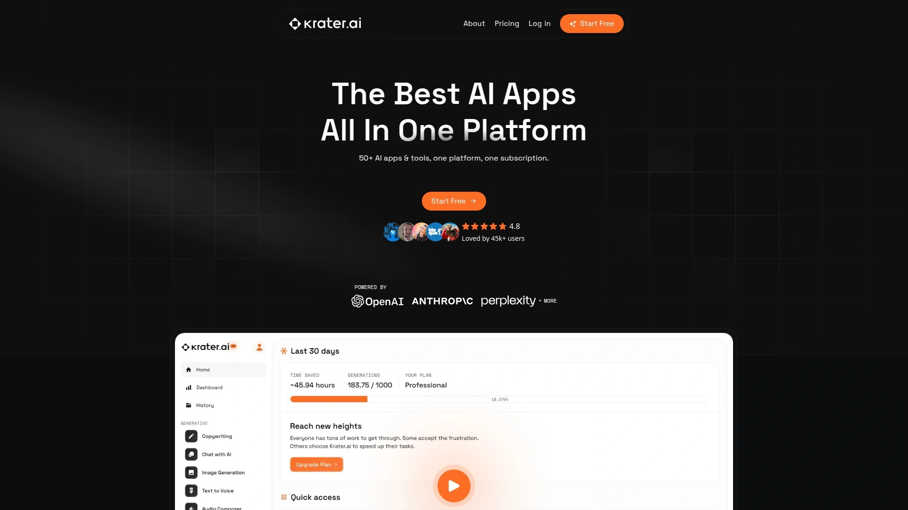
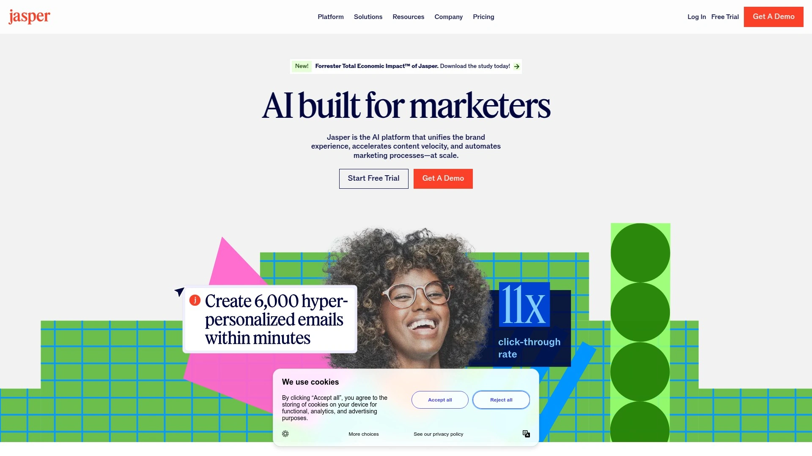
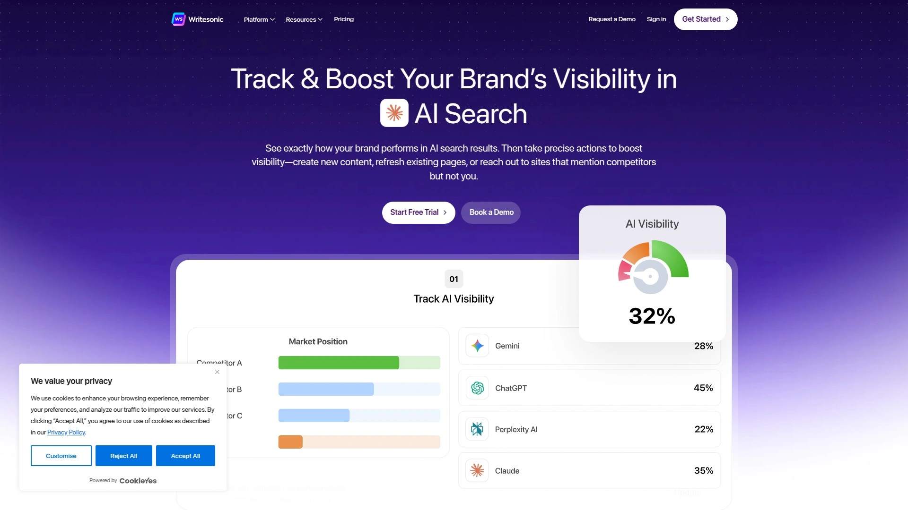
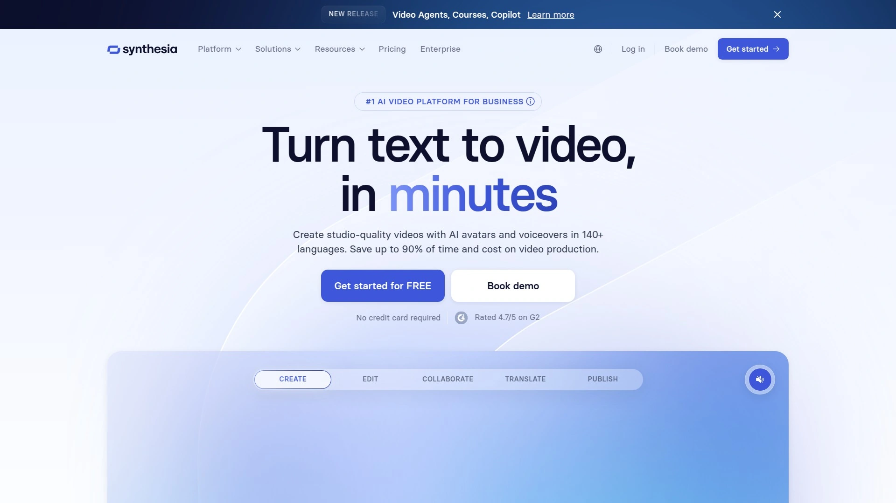
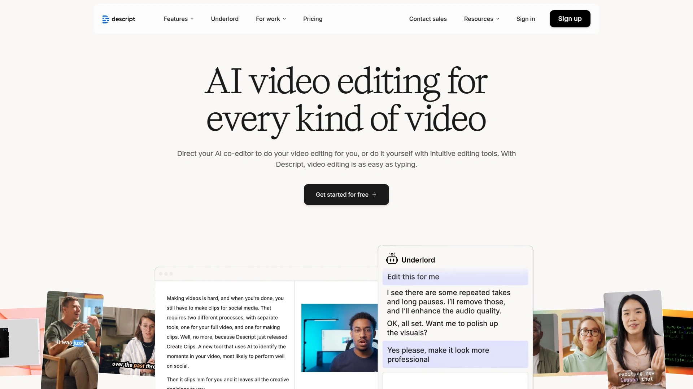
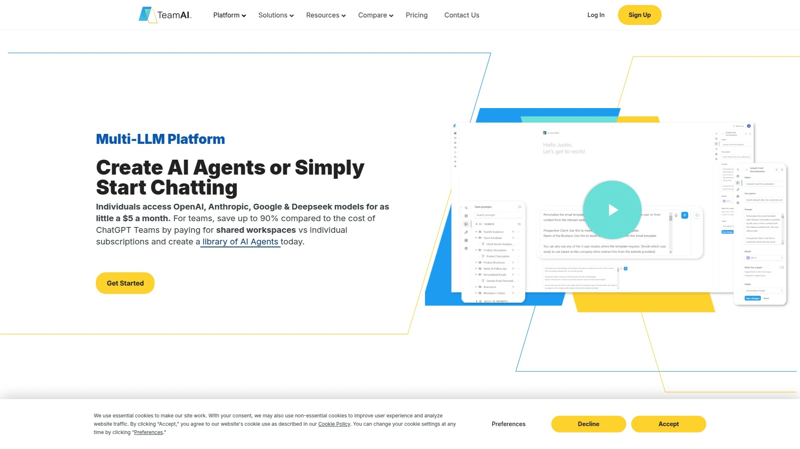
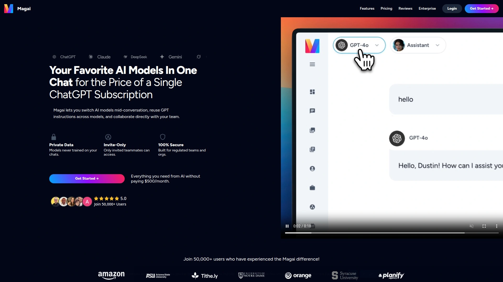

# 2025's Top 9 Best All-in-One AI Content Platforms

Juggling subscriptions for ChatGPT, Midjourney, speech-to-text tools, and coding assistants drains budgets fast while forcing constant app-switching that kills productivity. Individual AI subscriptions add up to hundreds monthly, yet none talk to each other or share your workflow context. Modern all-in-one AI platforms consolidate these scattered tools into unified hubs, delivering comprehensive functionality at a fraction of the cost while maintaining quality across writing, image generation, voice synthesis, and code creation.

## **[Krater.ai](https://krater.ai)**

50+ AI applications unified in one SuperApp.

Krater.ai eliminates the need for multiple AI subscriptions by consolidating over 50 AI-powered tools into a single, intuitive platform. The system includes image generation, copywriting, AI chat, speech-to-text, text-to-speech, and code generation capabilities designed for businesses of any size. Machine learning algorithms and natural language processing technology analyze data in real time, providing insights that improve products and help understand customer needs better.

The platform excels at content creation across formats—whether generating compelling marketing content, automating customer conversations, or converting text to voice seamlessly. Users can create engaging ad copy, transcribe audio files accurately, chat with AI to generate new ideas, design beautiful social media images, and produce realistic voiceovers without technical expertise. The coding assistant streamlines development across multiple programming languages, while the advanced code analyzer identifies bugs and optimizes performance automatically.

Pricing starts at just $9 monthly for the Personal plan including 100 generations, making enterprise-grade AI accessible to individuals and small teams. The Professional tier at $39 monthly and Enterprise option at $399 monthly scale with growing needs. A free plan lets users test core features before committing. All plans include unlimited use cases, complete access to future tools, and beta templates. The platform integrates with Eden AI's diverse model ecosystem, ensuring cutting-edge capabilities without vendor lock-in.

## **[Jasper AI](https://www.jasper.ai)**

Enterprise content creation with brand voice consistency.

Jasper serves over 100,000 customers globally, including major Fortune 500 companies requiring sophisticated content generation at scale. The platform specializes in creating blog posts, social media updates, email campaigns, and marketing copy that maintains consistent brand voice across all outputs. AI-powered templates cover dozens of content types, from product descriptions to video scripts.

The Boss Mode editor provides long-form content capabilities, generating articles of 2,000+ words with proper structure and flow. SEO integration helps content rank in search engines through keyword optimization and readability scoring. Team collaboration features enable multiple users to work simultaneously with role-based permissions controlling access. Browser extensions bring Jasper functionality directly into existing workflows without constant app-switching. The platform's API allows custom integrations with business systems for automated content pipelines.

## **[Writesonic](https://writesonic.com)**

SEO-focused writing with rapid article generation.

Writesonic targets content marketers and SEO professionals needing bulk article production without sacrificing quality. The platform generates blog posts, landing pages, product descriptions, and ad copy optimized for search visibility. Over 200,000 businesses use Writesonic to automate writing tasks and save 80% of content creation time.

The Sonic Editor provides Google Docs-style writing environment enhanced with AI suggestions appearing inline as you type. Article Writer 5.0 generates complete blog posts from just headlines, including research, outline creation, and final composition in minutes. Paraphrasing tools rewrite existing content to avoid duplication penalties while maintaining meaning. Landing page generator creates conversion-optimized sales pages through proven templates and persuasive copy frameworks. Support for 25+ languages enables global content strategies without hiring multilingual writers.

## **[Copy.ai](https://www.copy.ai)**

Conversational AI writing for marketing teams.

Copy.ai emphasizes natural, conversational writing that connects with audiences authentically rather than sounding robotic. The platform serves over 10 million users worldwide, from solopreneurs to enterprise marketing departments. Over 90 copywriting templates cover specific use cases like cold emails, product descriptions, social media captions, and blog introductions.

The workflow automation features chain multiple AI operations together, turning single inputs into complete campaigns. For example, one product description automatically generates corresponding social posts, email sequences, and ad variants. Tone adjustment controls let you switch between professional, casual, humorous, or urgent styles instantly. Team collaboration with workspaces keeps projects organized across departments. The multilingual support spans 29+ languages, making international expansion straightforward.

## **[Canva](https://www.canva.com)**

Visual design platform with integrated AI tools.

Canva revolutionized graphic design by making professional-quality visuals accessible to non-designers. The platform now integrates AI-powered features throughout its 250,000+ templates spanning social media graphics, presentations, videos, logos, and print materials. Over 100 million users rely on Canva for visual content creation monthly.

Magic Design generates complete design sets from simple text prompts or uploaded images, producing multiple layout variations instantly. Text-to-image AI creates custom graphics matching your creative direction without stock photo limitations. Background remover automatically isolates subjects from images with precision. Magic Eraser removes unwanted elements from photos cleanly. The brand kit feature maintains visual consistency by storing logos, fonts, and color palettes accessible across all designs. Real-time collaboration enables teams to comment, suggest edits, and approve work within the platform.

## **[Synthesia](https://www.synthesia.io)**

AI video creation with realistic human avatars.

Synthesia transforms video production by generating professional videos featuring AI presenters speaking naturally in 120+ languages. Organizations use Synthesia for training videos, product demos, marketing content, and internal communications without cameras, actors, or studios. The platform reduces video production costs by up to 90% compared to traditional methods.

Choose from 140+ diverse AI avatars or create custom avatars matching your brand spokesperson. Simply type your script, select an avatar and background, and the AI generates a polished video in minutes. The lip-sync technology maintains perfect synchronization across all languages automatically. Screen recording and media library integration add context to presentations. Template library provides proven video structures for common use cases. Enterprise features include SSO, branded players, and usage analytics tracking engagement.

## **[Descript](https://www.descript.com)**

Edit videos by editing text transcripts.

Descript pioneered text-based video editing, where you edit videos by simply modifying the automatically-generated transcript. Delete words from the transcript and the corresponding video segments disappear. This revolutionary approach makes video editing accessible to anyone who can edit documents. The platform includes comprehensive audio editing, screen recording, and publishing tools.

Overdub technology creates AI voice clones from voice samples, letting you "type" corrections rather than re-recording entire segments when you make mistakes. Studio Sound removes background noise and enhances audio quality with one click, making home recordings sound professionally produced. Remote recording enables podcast interviews with separate high-quality tracks per participant. The multi-track timeline accommodates complex projects requiring traditional editing precision. Publishing integrations push finished videos directly to YouTube, TikTok, and other platforms.

## **[TeamAI](https://teamai.com)**

Multiple AI models unified with workspace collaboration.

TeamAI provides access to OpenAI, Anthropic, Google, and Deepseek models through one platform, eliminating the need for separate ChatGPT Plus, Claude Pro, and Gemini subscriptions. This multi-model approach lets teams choose optimal AI for each specific task while maintaining unified workflows. Businesses save up to 90% compared to individual subscriptions.

Shared workspaces replace individual accounts, enabling collaboration on prompts, agents, and workflows accessible to entire teams. The prompt library stores proven templates specific to your business needs, ensuring consistency and saving time. Document chat functionality analyzes internal files uploaded once to a centralized AI Data Hub. No-code agent builder creates specialized AI assistants understanding your business processes without programming skills. Automated workflows connect multiple steps into repeatable processes following customizable roadmaps.

## **[Magai](https://magai.co)**

50+ AI models accessible through one interface.

Magai consolidates access to over 50 different AI models and tools, serving 50,000+ professionals requiring seamless AI integration across workflows. The platform removes the complexity of managing multiple API keys, billing accounts, and interface conventions by unifying everything into a consistent experience. This approach particularly benefits agencies and consultants serving diverse client needs.

Chat with leading models including GPT-4, Claude, Gemini, and specialized alternatives for specific tasks. Image generation spans Midjourney, DALL-E, Stable Diffusion, and other top platforms without separate subscriptions. Document analysis processes PDFs, spreadsheets, and presentations extracting insights automatically. Web research agents browse and synthesize information from multiple sources. The brand voice feature ensures outputs match your established tone and style guidelines across all generated content.

### FAQ Common Questions

**How do all-in-one AI platforms compare in output quality versus specialized tools?**
Modern unified platforms access the same underlying AI models as standalone tools, delivering equivalent quality while adding convenience through integrated workflows and shared context across features.

**Can businesses transition existing workflows to consolidated AI platforms easily?**
Most platforms provide import tools, API integrations, and familiar interfaces that minimize learning curves, with typical onboarding completing within days rather than weeks required for building custom solutions.

**Are enterprise-grade AI capabilities accessible to small businesses and individuals?**
Contemporary platforms offer tiered pricing starting as low as $9 monthly, democratizing access to sophisticated AI tools previously requiring five-figure annual investments and dedicated technical teams.

### Conclusion

Consolidating AI tools into unified platforms delivers immediate cost savings while eliminating the productivity drain of constant app-switching and context loss. The right system provides enterprise capabilities without enterprise complexity, making sophisticated AI accessible regardless of team size or technical expertise. For users seeking comprehensive AI functionality spanning content creation, image generation, voice synthesis, and code development without juggling multiple subscriptions, [Krater.ai](https://krater.ai) delivers 50+ specialized tools through one intuitive SuperApp interface at pricing that makes advanced AI capabilities practical for businesses of every size.
